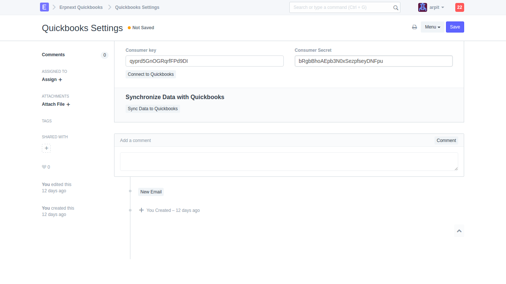
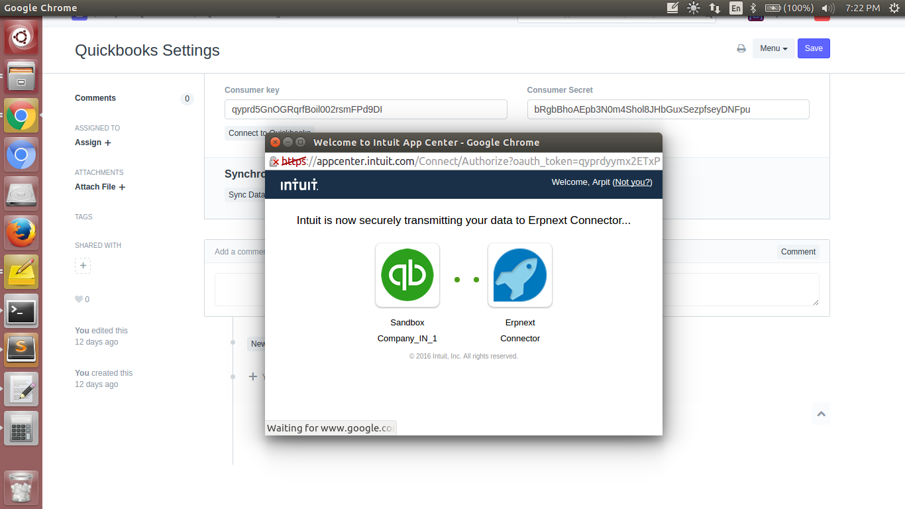

## Erpnext Quickbooks

Quickbooks connector for ERPNext

---

ERPNext Quickbooks is built on the [Frappé](https://github.com/frappe/frappe) Framework, a full-stack web app framework in Python & JavaScript.

Requires [EPRNext](https://github.com/frappe/erpnext), 

Once you install ERPNext run -

```
$ bench get-app erpnext_quickbooks https://github.com/indictranstech/erpnext_quickbooks.git
$ bench install-app erpnext_quickbooks
```


This Connector will Sync the data from Quickbooks Online to ERPNext

To Sync the data first you should have Quickbooks Online account.

Go to this Url (https://developer.intuit.com) and create Quickbooks account , After this create new Quickbooks app and grab Consumer Key and Consumer Secret from that quickbooks-app.
This process has to be done only once.


Setups 
1. Insert both the key



2. Click "Connect to Quickbooks" Button , after that new pop window will open 


3. Click Authorize Button 




#### License

GNU GPL v3.0
